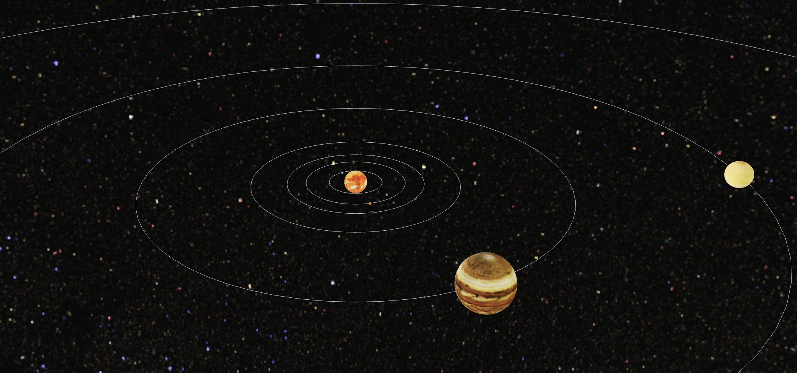

# 컴퓨터 그래픽스 과제
- Web GL을 활용한 태양계 구성
- ReactJS, ThreeJS

## reference
- https://github.com/bailus/WebGL-Solar-System.git
    - WebGL-Solar-System 레포지토리에서 태양과 행성들의 texture 이미지를 가져왔습니다.
- https://codesandbox.io/s/animated-solarsystem-with-react-three-fiber-2-1-w821r?file=/src/App.js:1651-1679
    - animated-solarsystem-with-react-three-fiber를 기반으로 실제 행성의 크기, 공전 반지름, 공전 주기, 자전 주기 등을 고려하여 코드를 수정하였습니다.
    - 다만, 실제 목성과 태양의 크기가 너무 크기 때문에 두 천체는 실제와 다른 비율을 적용하였습니다.
